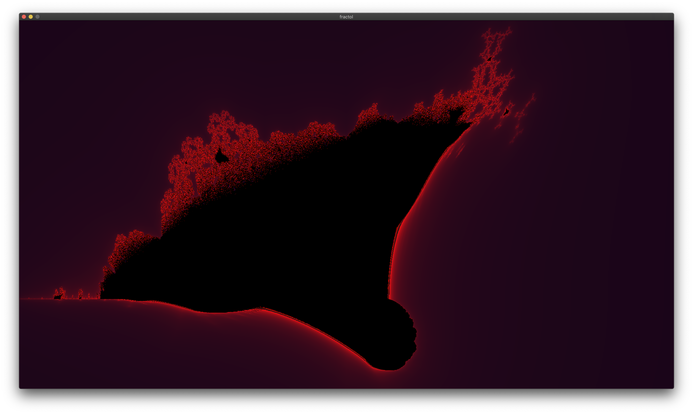
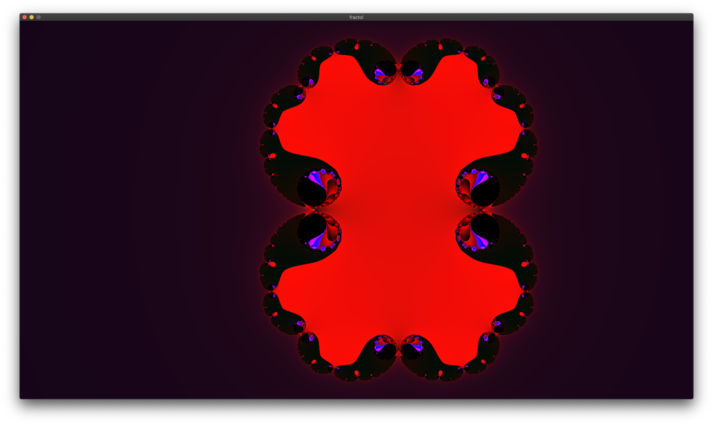
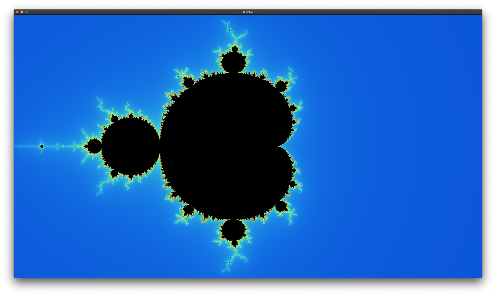

# Fract-ol
Fractal calculation project using the “OpenCL” technology and its rendering.

Download:
1) Clone the repository with the "--recursive" flag.

Install (only for Linux or macOS):
1) Run the "make" command to compile the program.
2) Run the "make clean" command to delete the object files.
3) Run the "make fclean" command to delete the object and executable files.
4) Run the "make re" command to delete the object and executable files, and recompile the program.

  
Run:
1) Run the "./fractol" command, which takes the name of the fractal as an argument 
  (the names of the fractals can be obtained by running the command "./fractol" without arguments).

Examples:
​
​
​
​
​
​
